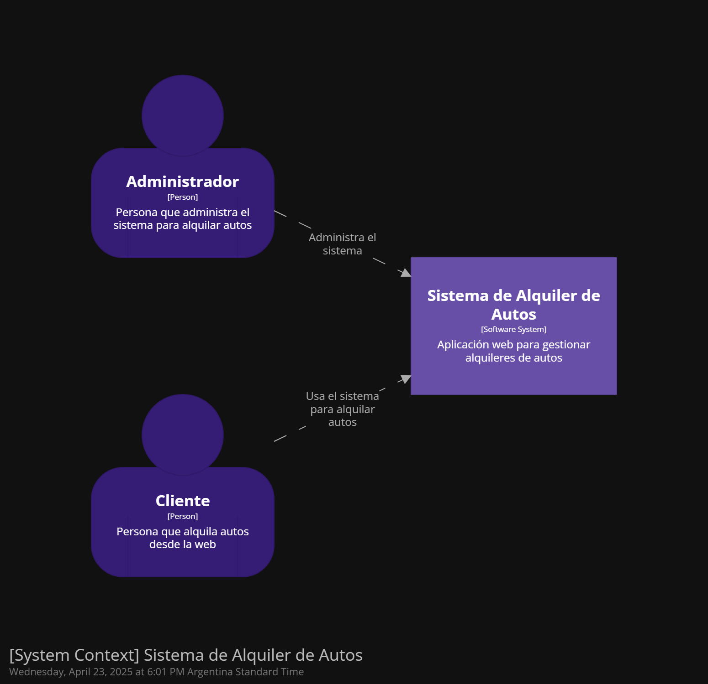
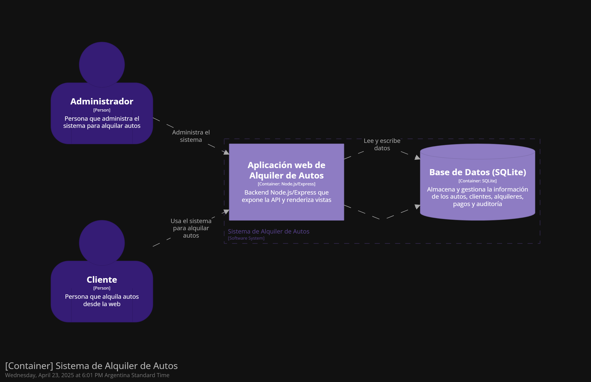
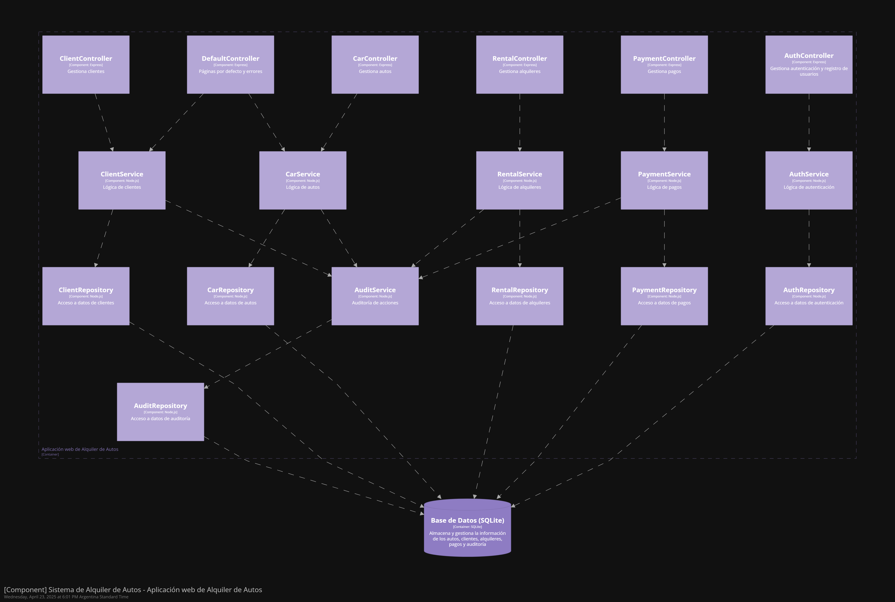

# alquiler-de-autos (rent-a-car)

Proyecto de alquiler de autos (rent-a-car).

## Requisitos previos

- Tener instalado [Node.js](https://nodejs.org/) (versión recomendada: >= 18.x)
- (Opcional) Tener configuradas las variables de entorno en un archivo `.env` en la raíz del proyecto. Ejemplo de variables:
  ```
  PORT=3000
  SESSION_SECRET=clave_secreta
  DB_PATH=./src/data/rentalDb.sqlite
  ```

> Si no dispones de un archivo `.env`, la app usará los valores por defecto indicados en el código.

## Instalación y ejecución

1. Clona el repositorio.
2. Instala las dependencias:
   ```cmd
   npm install
   ```
3. Inicia la aplicación:
   ```cmd
   npm start
   ```
4. Corre los tests:
   ```cmd
   npm test
   ```

## Agradecimientos / Autoría

Inspirado en las clases de r/argentina-programa (Fabricio Sodano) y el repositorio https://github.com/mpaternostro/rent-a-car (Marcelo Paternostro).

## Introducción

CRUD implementado en Node.js/Express para añadir, actualizar y eliminar autos.
El proyecto se fue actualizando y se implementaron sistemas de auth (manejo de sesiones), registro de auditoría e integración de pago básica con PayPal.

## Diagrama de clases


## Diagrama C4







### English version of the diagrams can be found in /docs/en/
