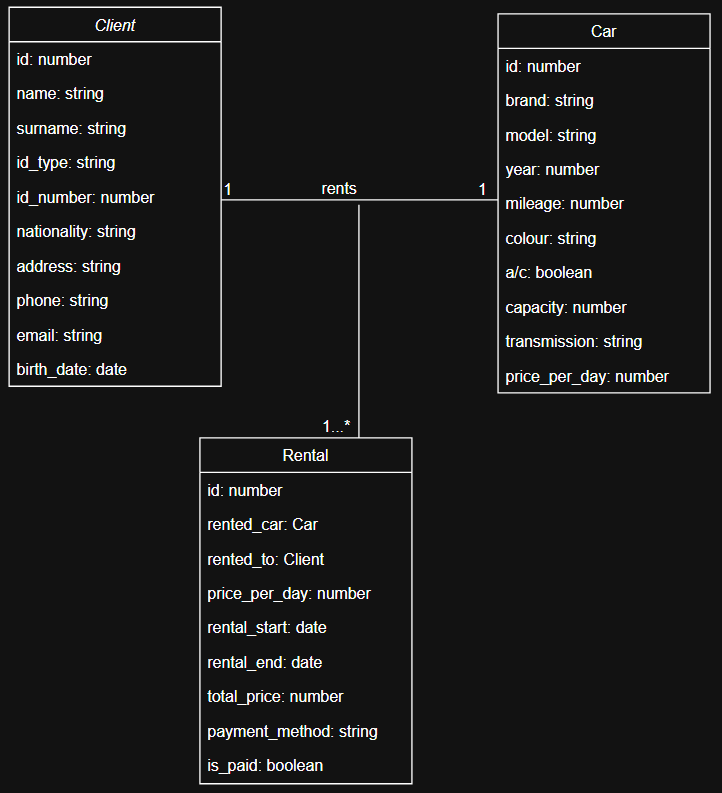
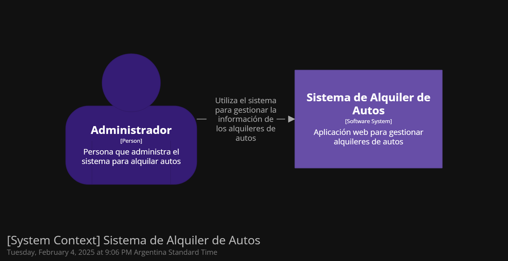
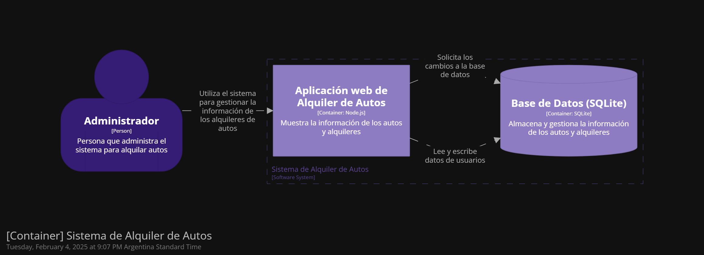
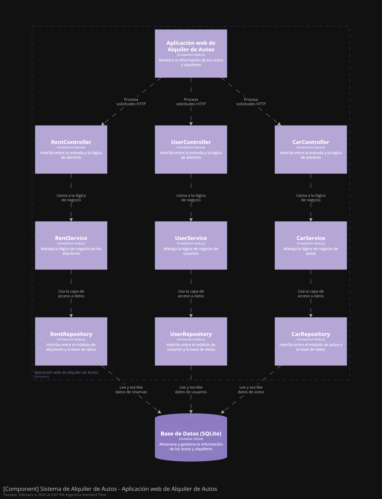

# alquiler-de-autos (rent-a-car)

Repositorio del proyecto de alquiler de autos (rent-a-car) para r/argentina-programa.

## Agradecimientos / Autoría

Inspirado en las clases de r/argentina-programa (Fabricio Sodano) y el repositorio https://github.com/mpaternostro/rent-a-car (Marcelo Paternostro).

## Introducción

CRUD implementado en Node.js/Express para añadir, actualizar y eliminar autos.

## Diagrama de clases

## Diagrama C4

